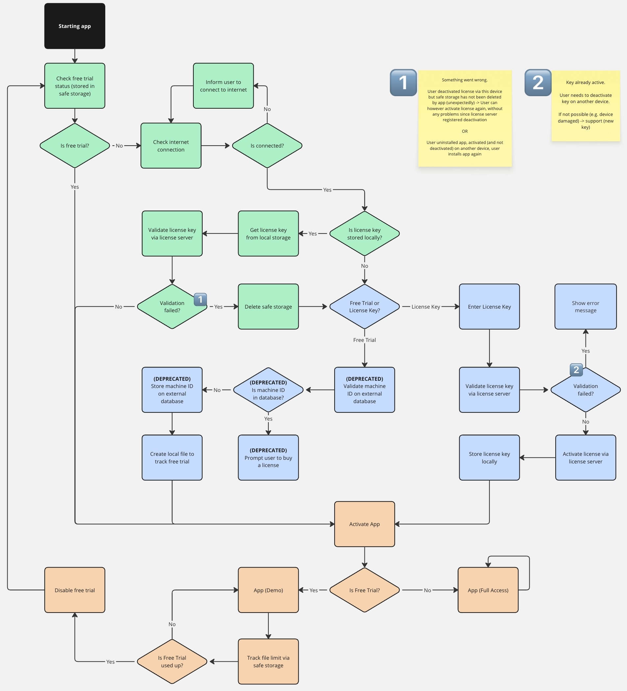

<!-- filepath: /Users/andrin/Documents/GitHub/exifoo/README.md -->
<p align="center">
    
    <h3 align="center">Shoot more. Organize less.</h3>
</p>

---

exifoo helps you keep your photos organized by adding the date and time of capture to the filename.

<p>Visit: <a href="https://exifoo.vercel.app" target="_blank">exifoo.vercel.app</a></p>

<br>

## Features

- **Select unlimited files:** Rename multiple files at once with no limits. Easily organize your entire photo collection in just a few clicks.
- **Flexible file naming:** Customize filenames to your needs. Choose the year and time format and add custom text to recognize photos even better.
- **Live Preview:** See your customization in action with a real-time example. Instantly preview how your filenames will look before renaming your photos.
- **Status Report:** Get a detailed status report after every renaming process, showing the number of successful and failed renames.
- **Privacy first:** All photos are processed offline, directly on your device. Your images never leave your computer.
- **No registration:** Start using exifoo right away. No sign up for an account, newsletter or anything else.
- **Simple and modern:** Clean, modern and easy-to-use interface. No technical knowledge required.

<br>

## Project Structure

```
backend/      # Python backend (EXIF processing and file renaming, License Management)
electron/     # Electron frontend (Vite, React, TailwindCSS)
```

### License Management

exifoo uses a license management system to enable free trials and full access. 
When starting the app, the license flow checks for a free trial or a valid license key.

<a href="https://miro.com/app/board/uXjVL9ViQRc=/" target="_blank" ></a>

<p style="font-size:8px">Check it out on miro: https://miro.com/app/board/uXjVL9ViQRc=/</p>

- 🟩 - Start
- 🟦 - Getting Started
- 🟧 - Main

<br>

## Getting Started

### Prerequisites

- [Node.js](https://nodejs.org/) (for Electron frontend)
- [Python 3.9+](https://www.python.org/) + [pip](https://pip.pypa.io/en/stable/) (for backend)

### Installation

1. **Clone the repository:**
    ```bash
    git clone https://github.com/codeofandrin/exifoo.git
    cd exifoo
    ```
2. **Create and activate venv**
    ```bash
    # for arm64 (Apple Silicon)
    python3.9 -m venv venv
    source venv/bin/activate

    # for x64 (Intel)
    python3.9 -m venv venv_x64
    eval \"$(/usr/local/bin/brew shellenv)\" && source venv_x64/bin/activate
    ```
3. **Install Python dependencies:**
    ```bash
    pip install -r requirements.txt
    ```
4. **Install Node.js dependencies:**
    ```bash
    # for concurrently
    npm install

    cd ../electron
    npm install
    ```

### Environment Configuration

This project uses environment variables for configuration. Example files are provided:

- [`backend/env.example.py`](backend/env.example.py): Example Python environment variables for the backend. Copy this file to `env.py` and adjust values as needed.
- [`electron/.env.example`](electron/.env.example): Example environment variables for the Electron/frontend. Copy this file to `.env` and adjust values as needed.

For the production build workflow, add following variables to the repository secrets:
- `GH_TOKEN`
- `MAC_API_KEY`
- `MAC_API_KEY_ID`
- `MAC_API_KEY_ISSUER_ID`
- `MAC_CERTS`
- `MAC_CERTS_PASSWORD`
- `SENTRY_AUTH_TOKEN`
- `STORAGE_KEY`
- `SUPABASE_KEY` (not used anymore, therefore can be empty)
- `SUPABASE_URL` (not used anymore, therefore can be empty)

Make sure to configure these files before running the app in development or production.

<br>

## Usage

### Development

```bash
# starts backend and electron app
npm run dev
```

### Build

#### Local Build
```bash
# builds the app for both architectures
npm run local-build:mac
```

#### Production Build
The github workflow ([`build.yml`](.github/workflows/build.yml)) will build the app for both architectures if a tag is 
commited starting with `v` (e.g. `v1.0.0`)

The build artifacts are published to [codeofandrin/exifoo-releases](https://github.com/codeofandrin/exifoo-releases) which is defined in
[`electron.vite.config.ts`](electron/electron.vite.config.ts):
```typescript
export default defineConfig({
    main: {
        // ...
        define: {
            __RELEASE_REPO__: s("https://github.com/codeofandrin/exifoo-releases")
        }
    },
    // ...
    renderer: {
        // ...
        define: {
            // ...
            __RELEASE_REPO__: s("https://github.com/codeofandrin/exifoo-releases")
        }
    }
})
```

<br>

## Copyright

Copyright (c) codeofandrin 

This source code is licensed under the MIT license found in the
[LICENSE](LICENSE) file in the root directory of this source tree.
